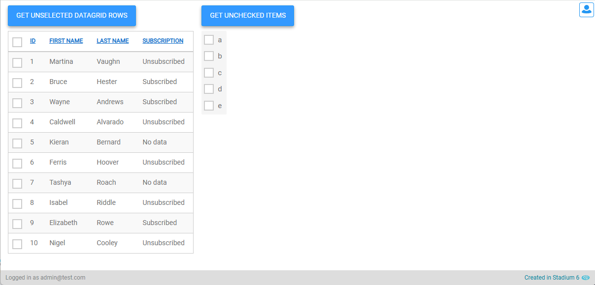

# Unselected List <!-- omit in toc -->

Get the list of unselected items from a DataGrid. 



# Version
Initial 1.0

# Setup

## Global Script
1. Create a Global Script called "UnselectedList"
2. Add the input parameters below to the Global Script
   1. List
   2. SelectedList
3. Add the output parameter below to the Global Script
   1. UnselectedList
4. Drag a *JavaScript* action into the script
5. Add the Javascript below into the JavaScript code property
```javascript
/* Stadium Script Version 1.0 https://github.com/stadium-software/utils-unselected-list */
let complete = ~.Parameters.Input.List;
let selected = ~.Parameters.Input.SelectedList;
let filtered = complete.filter(function (i) {
    return !selected.some(function (j) {
        return !Object.keys(j).some(function (prop) {
            if (prop !== "selection-id") {
                return i[prop] != j[prop];
            }
        });
    });
});
return filtered;
```
6. Drag a *SetValue* action below the Javascript action
   1. Target: The "UnselectedList" output parameter
   2. Value: The value returned by the Javascript action


## Page Setup
1. Drag a DataGrid to the page
2. Check the *Selectable Data* property checkbox on the control

## Event Handler
1. Drag the "UnselectedList" script to an event handler (e.g. a Save button)
2. Provide values for the input parameters
   1. List: The complete list of data (e.g. DataGrid.Data)
   2. SelectedList: The slice of data to be excluded form the complete list (e.g. DataGrid.SelectedData)


The Global Script returns the List of items that were in the *List*, but not in the *SelectedList*

## Working with Stadium Repos
Stadium Repos are not static. They change as additional features are added and bugs are fixed. Using the right method to work with Stadium Repos allows for upgrading them in a controlled manner. How to use and update application repos is described here 

[Working with Stadium Repos](https://github.com/stadium-software/samples-upgrading)